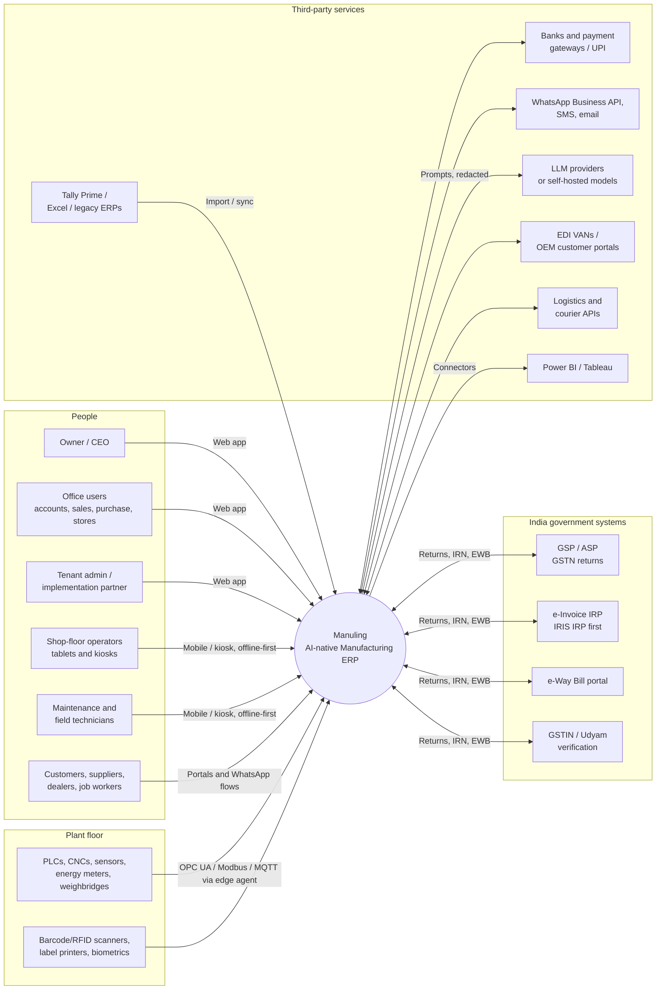
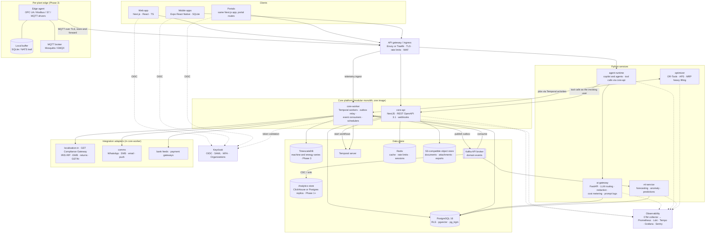
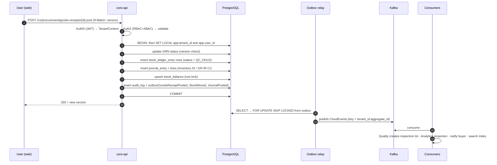
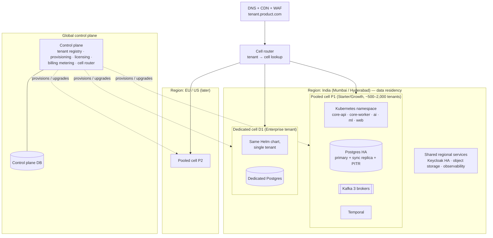
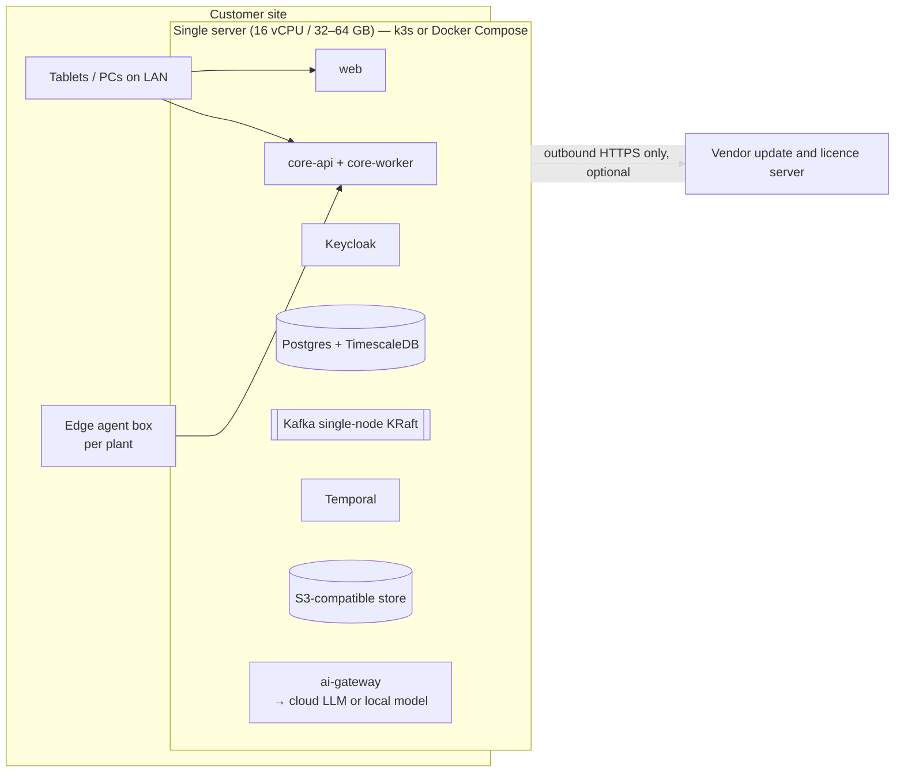

# 01 — System Architecture

Status: **Draft for approval** · Owner: Architecture · Last updated: 2026-09-24

This document describes the target architecture of Manuling across all phases. It shows what exists in Phase 0/1 and what gets added later. Decisions referenced as `ADR-NNNN` live in [`/docs/adr`](../adr/README.md).

---

## 1. Architectural drivers

| Driver                                           | Source          | Architectural consequence                                                                                                                                                                 |
| ------------------------------------------------ | --------------- | ----------------------------------------------------------------------------------------------------------------------------------------------------------------------------------------- |
| One data model, zero re-entry                    | PRD §2.1        | A single transactional PostgreSQL store per tenant cell. Modules own their tables but share one database and one transaction boundary where they need to (for example stock + GL posting) |
| Real-time, event-driven                          | PRD §2.2, §8    | Transactional outbox → Kafka. Every state change emits a versioned domain event                                                                                                           |
| SaaS + private cloud + on-prem from one codebase | PRD §0, §8      | Everything runs in containers and uses only portable dependencies (Postgres, Kafka API, S3 API, OIDC, Temporal). No cloud-proprietary service sits in the critical path                   |
| SMB price point                                  | PRD §0, §14     | Pooled multi-tenancy with RLS. The whole platform runs on one VM (about 32 GB) for on-prem Starter customers                                                                              |
| Enterprise isolation                             | PRD §8, §12     | "Cells": the same stack deployed as pooled cells or dedicated single-tenant cells                                                                                                         |
| Shop-floor offline                               | PRD §2.6, §5.17 | Offline-first mobile with local SQLite + sync. Per-plant edge agent with store-and-forward                                                                                                |
| Correct accounting and traceability              | PRD §10         | Append-only double-entry ledgers (inventory and GL) posted in the same DB transaction (ADR-0006)                                                                                          |
| AI-native with guardrails                        | PRD §6          | An AI gateway and agent runtime that call the ERP **only through the public API as the invoking user**, and that logs every action                                                        |
| Configure, don't customise                       | PRD §2.4, §8    | Metadata-driven custom fields/objects, workflow DSL, sandboxed scripting. Extensions never touch core tables                                                                              |

---

## 2. System context (C4 level 1)

---

## 3. Container view (C4 level 2)

### Container responsibilities

| Container         | Tech                                                | Responsibility                                                                                                                                                                                       | Scales by             |
| ----------------- | --------------------------------------------------- | ---------------------------------------------------------------------------------------------------------------------------------------------------------------------------------------------------- | --------------------- |
| **core-api**      | NestJS on Node 22 LTS                               | All synchronous commands and queries for every bounded context. Validates, authorises and writes to Postgres with the outbox in the same transaction                                                 | Horizontal, stateless |
| **core-worker**   | Same codebase, different entrypoint                 | Temporal workflow/activity workers, outbox relay, Kafka consumers (projections, notifications, search indexing), integration adapters, scheduled jobs                                                | Horizontal per queue  |
| **web**           | Next.js (App Router) as a client-rendered app shell | Office UI, portals, command palette, copilot panel. Server components only for the shell and i18n bootstrap; data comes from core-api via TanStack Query                                             | Horizontal/CDN        |
| **mobile**        | Expo React Native                                   | Stores, approvals and (later) operator, technician and ESS apps. Offline-first with SQLite and a sync protocol (ADR pending, Q10)                                                                    | n/a                   |
| **ai-gateway**    | FastAPI                                             | Provider-agnostic LLM access, per-tenant model policy, PII redaction, prompt/response logs, token metering                                                                                           | Horizontal            |
| **agent-runtime** | FastAPI + an agent framework                        | Copilot sessions and background agents. **Has no DB write access to ERP data**: every action goes through core-api with a delegated user token, so permissions, validation and audit apply unchanged | Horizontal            |
| **ml-service**    | FastAPI, scikit-learn / statsforecast / LightGBM    | Training and serving forecasting, anomaly and prediction models. Returns confidence and drivers with every prediction                                                                                | Horizontal + batch    |
| **optimizer**     | Python, OR-Tools CP-SAT                             | Finite-capacity scheduling, what-if, sequencing                                                                                                                                                      | Job-based             |
| **edge-agent**    | Go or Rust (ADR in Phase 3)                         | Protocol drivers, local buffering (≥72 h), edge rules, store-and-forward                                                                                                                             | Per plant             |

**Why core-api and core-worker are one codebase:** both import the same domain modules. One Docker image with two entrypoints keeps the modular monolith deployable as a single unit and lets us scale workers separately (ADR-0002).

---

## 4. Request and event lifecycle

This is how a typical write (posting a Goods Receipt) flows through the system and shows the key invariants.

Invariants:

1. Ledger postings that must balance happen **synchronously in one DB transaction** (in-process calls across modules through their published application interfaces). Only reactions that can tolerate lag go through Kafka.
2. Consumers are idempotent (the `event_id` goes into a per-consumer `inbox` table).
3. Kafka ordering is per aggregate (the partition key includes the aggregate id).

---

## 5. Deployment views

### 5.1 Multi-tenant SaaS (default)

- A **cell** is one complete stack deployed from one Helm chart. Pooled cells use RLS; dedicated cells run the same code with one tenant (ADR-0005).
- Blue/green or canary rollouts happen per cell through Argo CD. Migrations follow expand/contract, so they are backward compatible (PRD §13).
- Backups: continuous WAL archiving (pgBackRest) to object storage in another zone, giving RPO ≤ 15 min. A standby cluster can be restored within 4 h (RTO).

### 5.2 Private cloud (customer's AWS/Azure/GCP account)

The same Helm chart and Terraform modules deploy a dedicated cell into the customer's account. The customer can choose managed Postgres (RDS/Azure Flexible/Cloud SQL) and managed Kafka. The control plane connects outbound only, for licence and update checks.

### 5.3 On-premise (SMB and regulated customers)

- Installer: a signed bundle (Helm chart + images) plus an `installer` CLI that runs preflight checks, generates secrets, sets up backups to a NAS or S3, and upgrades in place.
- Air-gapped mode: offline licence file, images from a local registry, and optional self-hosted LLM (open-weights model on a GPU box) through the same ai-gateway.

### 5.4 Edge (per plant, Phase 3)

The edge agent runs on an industrial PC or ARM box under Docker/k3s. It reads PLCs (OPC UA, Modbus, S7, EtherNet/IP) and retrofit sensors, publishes to a local MQTT broker, buffers at least 72 h locally, and forwards over mTLS to the cloud or on-prem ingestion endpoint. It also caches the operator-terminal data it needs, so the shop floor keeps running on the LAN during WAN outages.

---

## 6. Cross-cutting concerns

| Concern                          | Approach                                                                                                                                                                                                                                                                                                                                                    |
| -------------------------------- | ----------------------------------------------------------------------------------------------------------------------------------------------------------------------------------------------------------------------------------------------------------------------------------------------------------------------------------------------------------- |
| **Identity**                     | Keycloak with a single realm plus Keycloak Organizations for tenants. Per-tenant IdP brokering (Azure AD, Google, SAML) for enterprise SSO. MFA policies per tenant. Short-lived access tokens (5 min) with refresh rotation (ADR-0009)                                                                                                                     |
| **Authorisation**                | In-app policy engine: roles → permissions (`inventory.goods_receipt.post`), scoped by company/plant/warehouse, plus ABAC conditions (amount limits, own-records) and field-level masks. Segregation-of-duties rules are checked at role assignment and at action time. Every endpoint declares its permission, and a lint rule fails CI when one is missing |
| **Tenant isolation**             | Postgres RLS on every tenant table (ADR-0005). Composite `(tenant_id, id)` foreign keys prevent cross-tenant references. CI runs an isolation test suite that attempts cross-tenant reads and writes on every table                                                                                                                                         |
| **Audit**                        | Row-level audit written by the application layer in the same transaction (who, what, before, after, source, correlation id). A hash chain per tenant provides tamper evidence for regulated tenants                                                                                                                                                         |
| **Money and quantity**           | `NUMERIC(20,6)` in the DB; `Money`/`Quantity` value objects on decimal.js in TS. JSON transports them as strings. Precision is configured per currency and per UoM (ADR-0008)                                                                                                                                                                               |
| **Time**                         | `timestamptz` in UTC everywhere. Business dates (posting date, document date) are `date` with an explicit fiscal calendar                                                                                                                                                                                                                                   |
| **i18n**                         | i18next keys for all UI text. ICU message format. Locale-aware number formatting (lakh/crore grouping for en-IN). Print templates render Indic scripts with embedded Noto fonts                                                                                                                                                                             |
| **Localisation (tax/statutory)** | A country pack plugin interface: tax determination, document requirements, e-invoicing, statutory reports. India is the first pack (ADR-0011)                                                                                                                                                                                                               |
| **API conventions**              | REST `/v1/{context}/{resource}`, cursor pagination, `If-Match`/ETag optimistic concurrency, `Idempotency-Key` on POSTs, RFC 9457 problem+json errors, state transitions as `POST …/{id}:submit` style actions                                                                                                                                               |
| **Observability**                | OpenTelemetry traces, metrics and logs. `tenant_id`, `user_id` and `correlation_id` on every span and log line. Per-tenant SLO dashboards                                                                                                                                                                                                                   |
| **Feature flags and licensing**  | Entitlements come from the control plane (edition, modules, seats, plants, meters). They are cached in core-api and enforced by guards on routes, UI slots and background jobs. Separate operational feature flags (OpenFeature API; Unleash or flagd backend)                                                                                              |
| **Extensibility**                | Custom fields as a `jsonb` extension column validated against metadata, custom objects in a generic, indexed store, sandboxed scripts (a V8 isolate with a CPU/memory budget) triggered by events and hooks, UI extension slots, and outbound webhooks. Extensions get their own schema and never write core tables directly                                |
| **Security**                     | OWASP ASVS L2, secrets in Vault (or the cloud KMS), TLS 1.3 by default, a CSP on the web app, SAST/DAST/SCA and container scanning in CI, signed images (cosign)                                                                                                                                                                                            |

---

## 7. Phase mapping

| Container / capability                                                                                    | P0      | P1      | P2         | P3                      | P4     |
| --------------------------------------------------------------------------------------------------------- | ------- | ------- | ---------- | ----------------------- | ------ |
| core-api, core-worker, web shell, Keycloak, Postgres, Kafka, Temporal, Redis, object store, observability | ●       |         |            |                         |        |
| Control plane (tenants, licensing, cell routing)                                                          | ● basic |         |            |                         | ● full |
| Mobile (stores, approvals)                                                                                |         | ●       | ● portals  | ● operator / technician |        |
| ai-gateway + copilot foundation (NL search, doc extraction)                                               |         | ●       |            |                         |        |
| Analytics store and dashboards                                                                            |         | ● basic | ● advanced |                         |        |
| ml-service (forecasting, anomaly)                                                                         |         |         | ●          |                         | ● full |
| optimizer (APS)                                                                                           |         |         |            | ●                       |        |
| Edge agent, TimescaleDB, digital twin                                                                     |         |         |            | ●                       | ● twin |
| agent-runtime (autonomous agents)                                                                         |         |         |            |                         | ●      |
