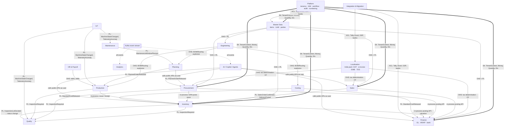
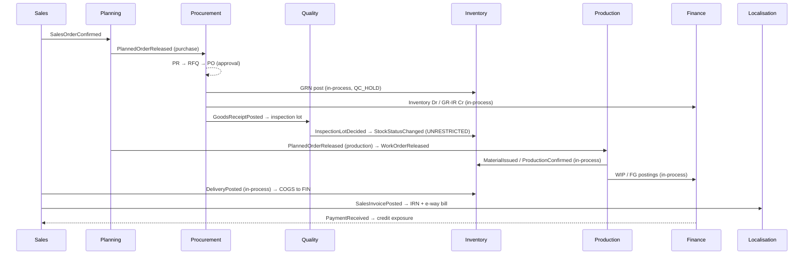

# 02 — Bounded-Context Map and Domain Events

Status: **Draft for approval** · Last updated: 2026-09-24

---

## 1. Bounded contexts

| #   | Context                          | Type             | Owns (aggregates)                                                                                                                                                                                                           | Phase                              |
| --- | -------------------------------- | ---------------- | --------------------------------------------------------------------------------------------------------------------------------------------------------------------------------------------------------------------------- | ---------------------------------- |
| 1   | **Platform**                     | Generic          | Tenant, Company, Plant, Department, User, Role, Permission, Policy, NumberingSeries, CustomFieldDef, CustomObjectDef, WorkflowDefinition/Instance, ApprovalTask, Notification, AuditLog, FeatureEntitlement, Document (DMS) | 0                                  |
| 2   | **Master Data**                  | Supporting       | Item, ItemRevision (thin in P1), UoM + conversions, Party (with Customer / Supplier / Transporter roles), Address, Contact, ItemCategory, HSN/SAC code refs                                                                 | 1                                  |
| 3   | **Localisation** (country packs) | Generic (plugin) | TaxCode, TaxRule, TaxDetermination, EInvoice, EWayBill, GstReturn, TdsSection, StatutoryReport                                                                                                                              | 1                                  |
| 4   | **Finance**                      | Core             | ChartOfAccounts, FiscalCalendar/Period, JournalEntry (GL ledger), AR/AP open items, Payment, BankAccount, BankTransaction, Reconciliation, CostCentre, ProfitCentre, PostingRule (account determination), CreditLimit       | 1                                  |
| 5   | **Sales**                        | Core             | Quotation, SalesOrder, PriceList, DiscountScheme, Delivery (shared with Logistics later), SalesInvoice, SalesReturn                                                                                                         | 1 (CRM/CPQ: 2–3)                   |
| 6   | **Procurement**                  | Core             | PurchaseRequisition, RFQ, SupplierQuotation, PurchaseOrder, GoodsReceipt, PurchaseInvoice (3-way match), JobWorkChallan                                                                                                     | 1                                  |
| 7   | **Inventory**                    | Core             | Warehouse, Location/Bin, Lot, Serial, StockLedgerEntry, StockBalance, ValuationLayer, StockTransfer, StockAdjustment, PhysicalCount                                                                                         | 1 (WMS: 3)                         |
| 8   | **Engineering**                  | Core             | BOM, BomLine, Routing, Operation, WorkCentre, ECR/ECO (P3), Recipe (P2/3)                                                                                                                                                   | 1 basic                            |
| 9   | **Production**                   | Core             | WorkOrder (production order), MaterialIssue, ProductionConfirmation, JobCard (P2), Genealogy link                                                                                                                           | 1 basic (MES: 3)                   |
| 10  | **Planning**                     | Core             | Forecast, MPS, MrpRun, PlannedOrder, Pegging, Schedule, Scenario                                                                                                                                                            | 2–3                                |
| 11  | **Quality**                      | Core             | InspectionPlan, InspectionLot, Characteristic results, NCR, CAPA, SPC series, Calibration                                                                                                                                   | 2 (inspection hooks stubbed in P1) |
| 12  | **Maintenance**                  | Supporting       | Asset, MaintenancePlan, MaintenanceOrder, Meter                                                                                                                                                                             | 2                                  |
| 13  | **Costing**                      | Core             | CostEstimate, StandardCost, CostRollup, Variance, OverheadRate                                                                                                                                                              | 2                                  |
| 14  | **HR & Payroll**                 | Supporting       | Employee, Skill, Shift, Attendance, PayrollRun, StatutoryConfig                                                                                                                                                             | 2                                  |
| 15  | **Logistics**                    | Supporting       | Shipment, PackingList, Transporter, FreightCost, ProofOfDelivery                                                                                                                                                            | 3                                  |
| 16  | **Projects (ETO)**               | Supporting       | Project, WBS, Milestone                                                                                                                                                                                                     | 3                                  |
| 17  | **Service**                      | Supporting       | InstalledBase, Warranty, ServiceContract, ServiceTicket                                                                                                                                                                     | 4                                  |
| 18  | **EHS & ESG**                    | Supporting       | Incident, Permit, EnergyReading rollup, EmissionFactor, CarbonFootprint                                                                                                                                                     | 4                                  |
| 19  | **IoT**                          | Supporting       | Device, Tag, Telemetry, MachineState, OEE                                                                                                                                                                                   | 3                                  |
| 20  | **Analytics**                    | Generic          | Read models, KPI definitions, Dashboards, Reports (downstream of everything; owns no transactional truth)                                                                                                                   | 1                                  |
| 21  | **AI**                           | Generic          | CopilotSession, AgentRun, AiActionLog, PromptTemplate, ModelPolicy, Embedding index                                                                                                                                         | 1 foundation, 4 agents             |
| 22  | **Integration / Migration**      | Generic          | ImportJob, MappingProfile, Connector, Webhook subscription, TallySync                                                                                                                                                       | 1                                  |

**Why Master Data is its own context:** Items and parties are referenced by nearly every context. SAP learned this the hard way and moved to "Business Partner". One Party with roles (customer, supplier, transporter, job worker, employee-as-payee) prevents duplicate records for a customer who is also a supplier, which is common in Indian job-work relationships.

---

## 2. Context map

Relationship legend: **U/D** upstream/downstream, **OHS** open-host service (published API), **PL** published language (event schemas), **CF** conformist, **ACL** anti-corruption layer, **SK** shared kernel.



### The synchronous vs asynchronous rule

| Interaction                                                                                                                 | Mechanism                                                                                                                                                  | Why                                                                                               |
| --------------------------------------------------------------------------------------------------------------------------- | ---------------------------------------------------------------------------------------------------------------------------------------------------------- | ------------------------------------------------------------------------------------------------- |
| Anything that must be **atomic with a ledger posting** (GRN → stock ledger → GL, delivery → COGS, production receipt → WIP) | **In-process call** to the downstream module's published application service (`InventoryPostingPort`, `FinancePostingPort`) inside the same DB transaction | The PRD requires real-time perpetual inventory. A broker hop would allow stock and GL to disagree |
| Reactions that can lag by seconds (create inspection lot, notify, re-plan, analytics, search index, AI)                     | **Domain event** via outbox → Kafka                                                                                                                        | Decoupling. Consumers can be extracted into services later                                        |
| Reads of another context's data                                                                                             | Published **query interface** (module facade) or a local read model built from events                                                                      | Never a direct SQL join into another module's tables                                              |

When a module is extracted into its own service later, an in-process posting call becomes a saga. The port interfaces are shaped for that from day one: commands carry idempotency keys and have compensating operations (reversal).

---

## 3. Domain events catalogue (Phase 0–1, plus key later events)

Naming: `{context}.{Aggregate}{PastTenseVerb}.v{n}`. Envelope: CloudEvents 1.0. Payload: JSON Schema in `packages/contracts/events`.

```json
{
  "specversion": "1.0",
  "id": "0192f1c4-…",            // UUIDv7, used for idempotency
  "type": "inventory.StockMoved.v1",
  "source": "core/inventory",
  "time": "2026-09-24T10:15:00Z",
  "tenantid": "…",
  "companyid": "…",
  "subject": "stock-ledger-entry/…",
  "correlationid": "…",           // from the originating request
  "causationid": "…",             // event that caused this one
  "actor": { "type": "user|agent|system|integration", "id": "…", "onBehalfOf": "…" },
  "datacontenttype": "application/json",
  "data": { … }
}
```

### Platform

| Event                                                  | Emitted when                       | Key consumers                                               |
| ------------------------------------------------------ | ---------------------------------- | ----------------------------------------------------------- |
| `platform.TenantProvisioned.v1`                        | New tenant created from a template | Master Data (seed), Finance (seed CoA), Analytics           |
| `platform.CompanyCreated.v1` / `PlantCreated.v1`       | Org structure changes              | Finance, Inventory, Analytics                               |
| `platform.UserRoleAssigned.v1`                         | Role granted                       | SoD checker, Audit, Notifications                           |
| `platform.ApprovalRequested.v1` / `ApprovalDecided.v1` | Workflow step                      | Notifications (in-app, email, WhatsApp), originating module |
| `platform.EntitlementChanged.v1`                       | Edition/module change              | All modules (cache bust)                                    |

### Master Data

| Event                                                                               | Consumers                                                         |
| ----------------------------------------------------------------------------------- | ----------------------------------------------------------------- |
| `masterdata.ItemCreated.v1`, `ItemChanged.v1`, `ItemBlocked.v1`                     | Inventory, Engineering, Sales, Procurement, Search, AI embeddings |
| `masterdata.PartyCreated.v1`, `PartyRoleAdded.v1`, `PartyVerified.v1` (GSTIN/Udyam) | Sales, Procurement, Finance (AR/AP accounts)                      |

### Sales

| Event                                                                            | Consumers                                                               |
| -------------------------------------------------------------------------------- | ----------------------------------------------------------------------- |
| `sales.QuotationIssued.v1`, `QuotationAccepted.v1`                               | Analytics, AI (win-probability)                                         |
| `sales.SalesOrderConfirmed.v1`, `SalesOrderChanged.v1`, `SalesOrderCancelled.v1` | Inventory (reservation), Planning (demand), Production (MTO), Analytics |
| `sales.DeliveryPosted.v1`                                                        | Localisation (e-way bill), Logistics, Analytics                         |
| `sales.SalesInvoicePosted.v1`                                                    | Localisation (e-invoice IRN), Finance projections, Collections, Comms   |

### Procurement

| Event                                                               | Consumers                                                              |
| ------------------------------------------------------------------- | ---------------------------------------------------------------------- |
| `procurement.PurchaseRequisitionApproved.v1`                        | Buyer worklist                                                         |
| `procurement.PurchaseOrderReleased.v1`                              | Comms (email/WhatsApp to supplier), Planning (supply), Supplier portal |
| `procurement.GoodsReceiptPosted.v1`                                 | Quality (inspection lot), Planning, MSME tracker                       |
| `procurement.PurchaseInvoiceMatched.v1` / `MatchExceptionRaised.v1` | Finance AP, Approvals                                                  |
| `procurement.JobWorkMaterialSent.v1` / `Returned.v1`                | Localisation (ITC-04), Inventory                                       |

### Inventory

| Event                                                            | Consumers                                        |
| ---------------------------------------------------------------- | ------------------------------------------------ |
| `inventory.StockMoved.v1` (one per ledger entry batch)           | Analytics, Planning (net change), Search         |
| `inventory.StockStatusChanged.v1` (QC_HOLD → UNRESTRICTED, etc.) | Planning, Sales ATP                              |
| `inventory.LotCreated.v1`, `LotExpiring.v1`                      | Quality, Notifications                           |
| `inventory.ReorderPointBreached.v1`                              | Procurement (auto-PR), AI procurement agent (P4) |

### Finance

| Event                                            | Consumers                                          |
| ------------------------------------------------ | -------------------------------------------------- |
| `finance.JournalPosted.v1`, `JournalReversed.v1` | Analytics (P&L real time), AI anomaly detection    |
| `finance.PaymentReceived.v1`, `PaymentMade.v1`   | Sales (credit exposure), Collections, MSME tracker |
| `finance.BankTransactionMatched.v1`              | Analytics                                          |
| `finance.PeriodClosed.v1`                        | All posting modules (lock)                         |
| `finance.CreditLimitExceeded.v1`                 | Sales (block), Approvals                           |

### Engineering and Production (P1 basic)

| Event                                                  | Consumers                                                                          |
| ------------------------------------------------------ | ---------------------------------------------------------------------------------- |
| `engineering.BomReleased.v1`, `RoutingReleased.v1`     | Production, Planning, Costing                                                      |
| `production.WorkOrderReleased.v1`                      | Inventory (reservations), Shop-floor UI                                            |
| `production.MaterialIssued.v1`                         | Genealogy, Costing (P2)                                                            |
| `production.ProductionConfirmed.v1` (with scrap/yield) | Inventory (FG receipt), Quality (in-process/final), Costing, Analytics (OEE later) |
| `production.WorkOrderClosed.v1`                        | Costing (variance), Finance (WIP settlement)                                       |

### Later phases (for reference)

`quality.InspectionLotDecided.v1`, `quality.NcrRaised.v1`, `quality.SpcRuleViolated.v1`, `planning.MrpRunCompleted.v1`, `planning.PlannedOrderReleased.v1`, `planning.RescheduleProposed.v1`, `iot.MachineStateChanged.v1`, `iot.TelemetryAnomalyDetected.v1`, `maintenance.MaintenanceOrderCreated.v1`, `hr.AttendancePosted.v1`, `costing.VarianceCalculated.v1`, `esg.CarbonFootprintCalculated.v1`, `ai.AgentActionProposed.v1`, `ai.AgentActionApproved.v1`.

---

## 4. Golden-scenario event trace (for design validation)

This shows how PRD §18 maps onto events. Phase 0/1 must not block any of these links.


