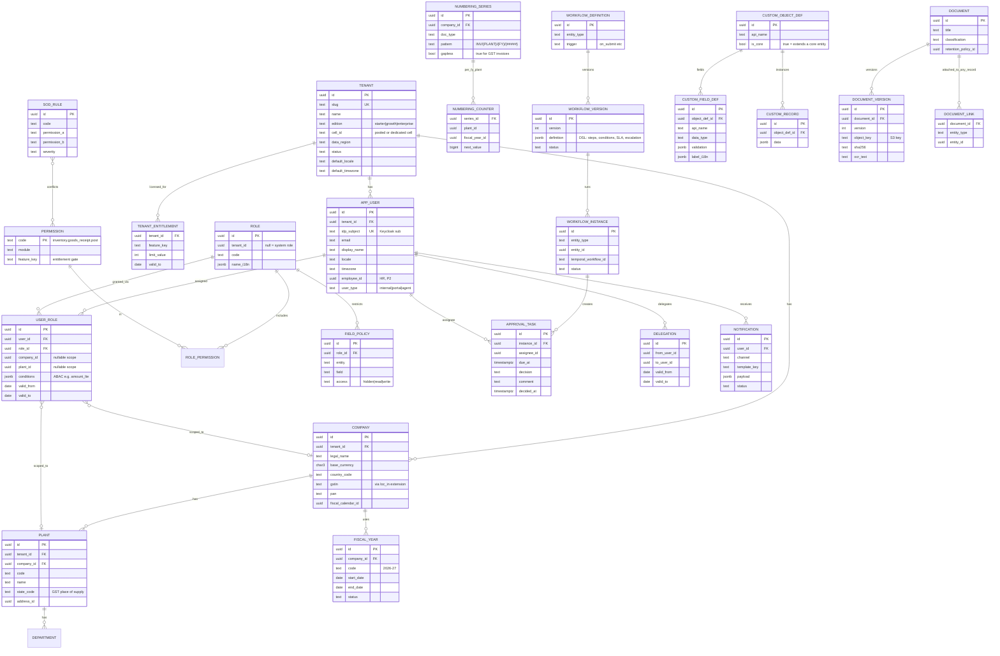
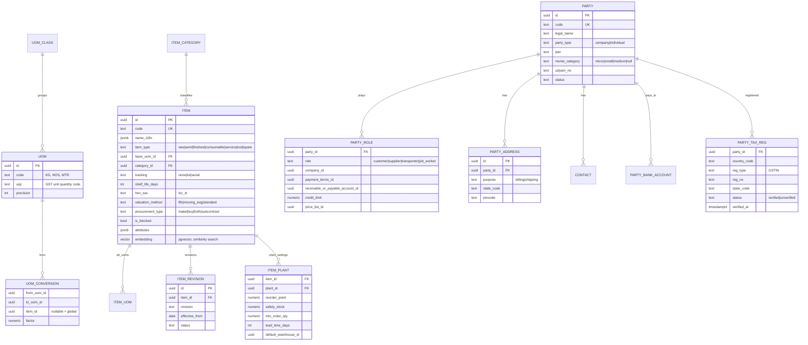
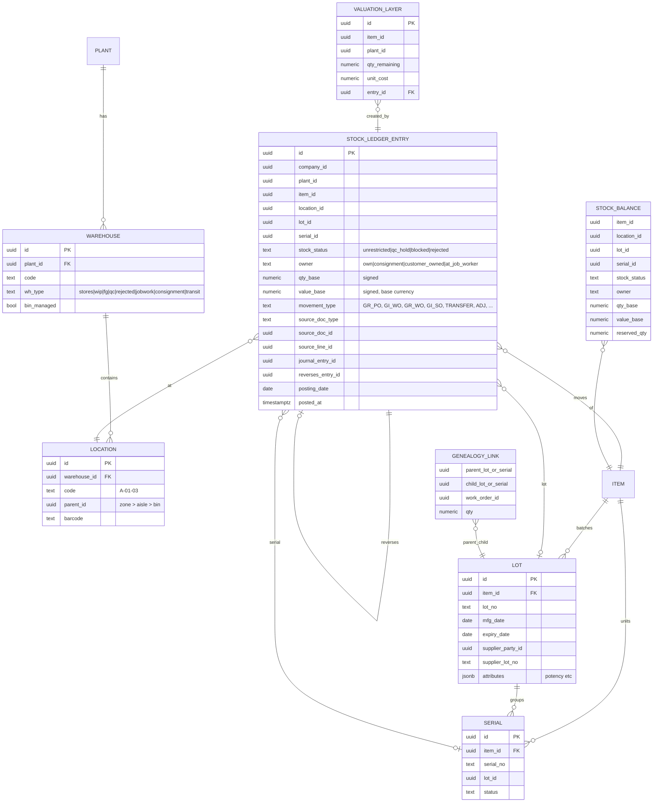
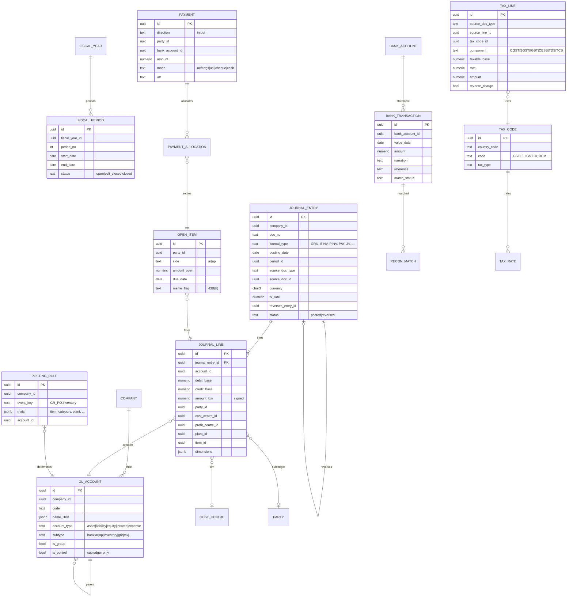
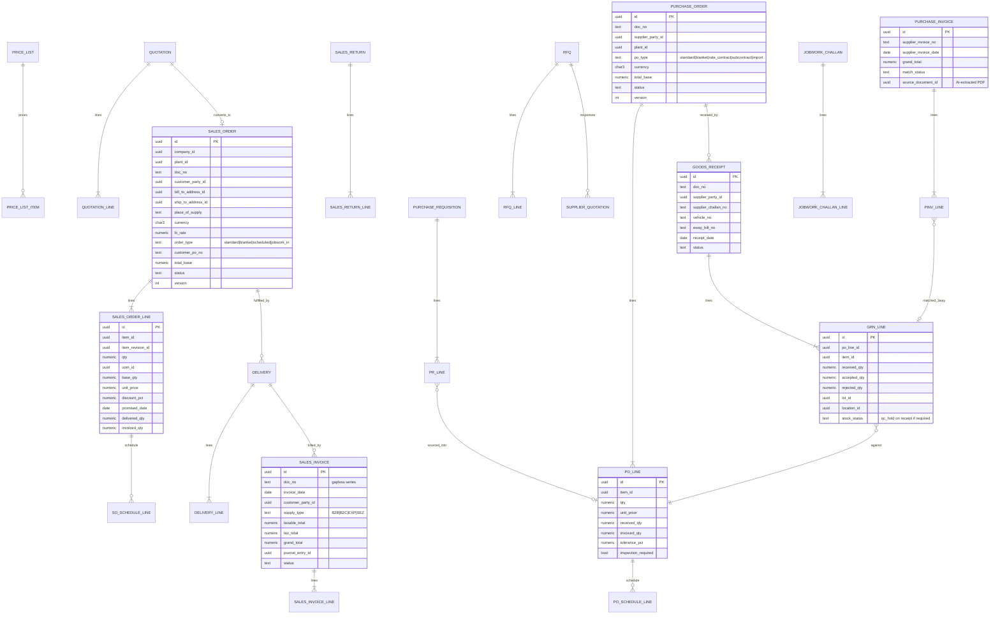
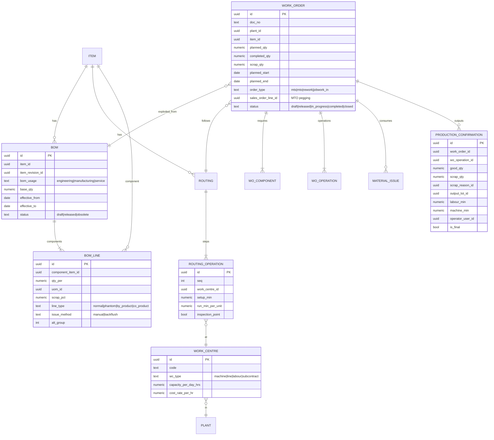

# 03 — Core ERD: Phase 0 and Phase 1

Status: **Draft for approval** · Last updated: 2026-09-24

---

## 0. Conventions that apply to every table

| Convention              | Rule                                                                                                                                                                                                                                 |
| ----------------------- | ------------------------------------------------------------------------------------------------------------------------------------------------------------------------------------------------------------------------------------ |
| Schema per module       | `platform.*`, `masterdata.*`, `finance.*`, `sales.*`, `procurement.*`, `inventory.*`, `engineering.*`, `production.*`, `loc_in.*` (India pack), `ai.*`, `integration.*`, `ext.*` (extensions)                                        |
| Primary key             | `id uuid` (UUIDv7, time-ordered, generated in the app)                                                                                                                                                                               |
| Tenancy                 | `tenant_id uuid not null` on every tenant-owned table, with an RLS policy (ADR-0005). Unique constraint on `(tenant_id, id)`. **Foreign keys are composite `(tenant_id, x_id)`**, so a row can never point at another tenant's row   |
| Company scope           | `company_id` on every transactional table. `plant_id` where relevant                                                                                                                                                                 |
| Cross-module FKs        | Allowed **only** towards `platform` and `masterdata` (upstream, stable). Otherwise references across modules are by id, validated in the application, with no DB constraint. This keeps modules extractable (ADR-0002)               |
| Standard columns        | `created_at timestamptz`, `created_by uuid`, `updated_at`, `updated_by`, `version int` (optimistic lock), `source text` (ui/api/import/agent/integration)                                                                            |
| Transactional documents | `status` enum following Draft → Submitted → Approved → Posted → Cancelled/Reversed. `doc_no` from a numbering series. `posting_date date`, `document_date date`. No hard deletes (DB role lacks DELETE; soft-delete only for drafts) |
| Money                   | `NUMERIC(20,6)` plus a `currency char(3)` column. Document header stores `fx_rate NUMERIC(18,9)` and base-currency amounts                                                                                                           |
| Quantity                | `NUMERIC(20,6)` plus `uom_id`. Lines also store `base_qty` in the item's base UoM                                                                                                                                                    |
| Extensions              | `ext jsonb not null default '{}'`, validated against `platform.custom_field_def` with a GIN index                                                                                                                                    |
| Ledgers                 | `inventory.stock_ledger_entry`, `finance.journal_line` and `platform.audit_log` are **INSERT-only** (UPDATE/DELETE revoked plus a trigger guard)                                                                                     |

The diagrams show key columns only. Full DDL comes with each module's migration.

---

## 1. Platform (Phase 0)

Plus these infrastructure tables (not drawn):

- `platform.audit_log`: id, tenant_id, entity_type, entity_id, action, before jsonb, after jsonb, actor_type, actor_id, on_behalf_of, source, correlation_id, ip, at, prev_hash, hash.
- `platform.outbox`: id (= event id), tenant_id, aggregate_type, aggregate_id, event_type, payload jsonb, created_at, published_at.
- `platform.inbox`: consumer, event_id (PK pair), processed_at.
- `platform.idempotency_key`: tenant_id, key, request_hash, response, expires_at.

The **control plane** (tenant registry, cells, subscriptions, meters) has its own database and does not appear here.

---

## 2. Master Data (Phase 1)

---

## 3. Inventory (Phase 1)

`STOCK_BALANCE` is a **derived, lock-protected projection**. It is updated in the same transaction as each ledger insert (`SELECT … FOR UPDATE`) so negative-stock checks and ATP are exact. A nightly job re-derives balances from the ledger and alerts on any drift.

---

## 4. Finance and tax (Phase 1)

**Balance enforcement:** a deferred constraint trigger checks `SUM(debit_base) = SUM(credit_base)` per `journal_entry_id` at commit. Posting into a closed period is rejected in the domain layer and again by a trigger. `gl_balance` (account × period × dimensions) is a lock-protected projection, the same pattern as `stock_balance`.

**India pack tables** (`loc_in.*`): `e_invoice` (IRN, ack no/date, signed QR, status, request/response log), `e_way_bill` (EWB no, validity, vehicle, part-B updates), `gstr2b_line` + `itc_match`, `tds_section`, `tds_deduction`, `itc04_record`, `msme_payment_tracker`, `gateway_provider_config` (per GSTIN × capability → provider, with the secret held in Vault), `gateway_call_log`. They reference core documents by `(source_doc_type, source_doc_id)`, and core has no knowledge of them (ADR-0011).

---

## 5. Sales and procurement (Phase 1)

---

## 6. Engineering and production (Phase 1, basic)

---

## 7. AI and integration (Phase 1 foundation)

| Table                              | Key columns                                                                                                                                                                                                                                | Purpose                                                           |
| ---------------------------------- | ------------------------------------------------------------------------------------------------------------------------------------------------------------------------------------------------------------------------------------------ | ----------------------------------------------------------------- |
| `ai.action_log`                    | id, tenant_id, actor (agent/copilot), on_behalf_of_user_id, session_id, tool, input jsonb, reasoning_summary, output jsonb, affected_entities, status (proposed/approved/executed/reversed), approved_by, reversal_of, model, tokens, cost | PRD §6.3 guardrails: every AI action logged, reversible, labelled |
| `ai.model_policy`                  | tenant_id, use_case, provider, model, allow_external, redaction_level                                                                                                                                                                      | Per-tenant model choice                                           |
| `ai.embedding`                     | tenant_id, source_type, source_id, chunk_no, content_hash, vector, acl_hash                                                                                                                                                                | RAG and similarity search with permission filtering               |
| `integration.import_job`           | id, kind (excel/tally), mapping_profile_id, status, stats, error_file_key                                                                                                                                                                  | AI-assisted migration                                             |
| `integration.webhook_subscription` | event_types, url, secret_ref, status                                                                                                                                                                                                       | Outbound webhooks                                                 |
| `integration.tally_mapping`        | company_id, entity_type, manuling_id, tally_name, tally_guid                                                                                                                                                                               | Tally migration and export mapping (ADR-0012)                     |
| `integration.tally_export`         | company_id, voucher_source_id, batch_id, status (pending/sent/accepted/rejected), tally_remote_id, error                                                                                                                                   | Idempotent one-way export log                                     |
