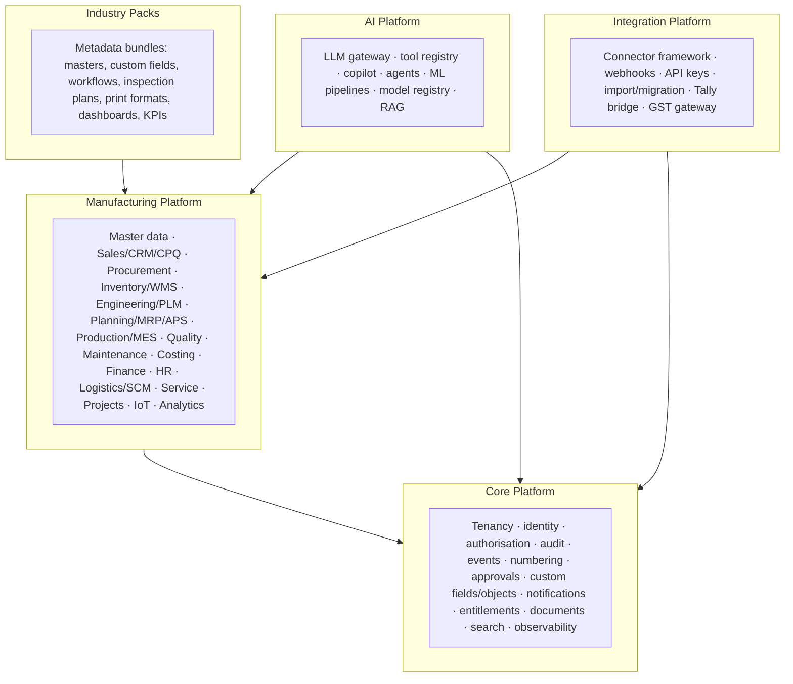
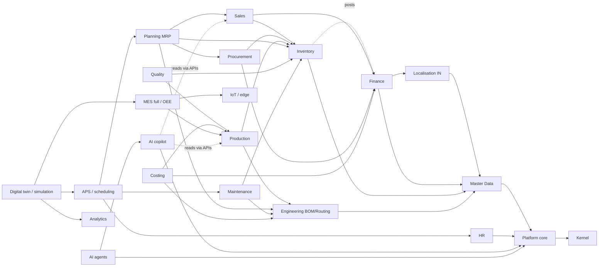

# 06 — Product Architecture, Module Map, Editions and Roadmap

Status: **Draft for approval** · 2026-09-27 · Answers brief v2 deliverables 1, 2, 15, 16, 17, 18, 19 (see [05](05-brief-v2-gap-analysis.md))

---

## 1. Product architecture (brief v2 §83)

Manuling is one codebase organised as five product layers. Each layer depends only on the layers below it. Modules inside a layer are switched on per tenant by entitlements (step 0.11).

| Layer                  | What it is                                                                                                    | Rule                                                                                                                     |
| ---------------------- | ------------------------------------------------------------------------------------------------------------- | ------------------------------------------------------------------------------------------------------------------------ |
| Core Platform          | Generic services that every module uses. Built in Phase 0 (steps 0.1–0.9 are done; 0.10–0.15 are in progress) | Knows nothing about manufacturing                                                                                        |
| Manufacturing Platform | The bounded contexts that hold business truth (ledgers, orders, BOMs, work orders)                            | Talks to other contexts only through ports and events ([02](02-context-map.md))                                          |
| Industry Packs         | **Data, not code.** Versioned bundles of configuration applied to a tenant                                    | A pack can never change core tables or add code paths. This is why there is no separate "automotive edition" (brief §56) |
| AI Platform            | Reads through the same APIs and permissions as users; acts only through tools that call the same use cases    | AI never gets a database connection of its own ([07](07-ai-architecture.md))                                             |
| Integration Platform   | Adapters behind ports, running in core-worker                                                                 | Every external system is replaceable; a sandbox adapter exists for each and is labelled as sandbox (brief §92)           |

## 2. Complete module map

Brief v2 lists about 60 capability areas. All of them map onto the 22 bounded contexts of [02](02-context-map.md) plus **three new contexts**: Commercial (SaaS billing), Customer Success, and Workforce Scheduling folded into HR. Nothing in the brief needs a context we cannot name. "Phase" uses the reconciled roadmap in §5.

| Brief v2 area (§)                                                 | Bounded context                                                                  | Edition                               | Phase                         |
| ----------------------------------------------------------------- | -------------------------------------------------------------------------------- | ------------------------------------- | ----------------------------- |
| Tenancy, identity, RBAC/ABAC, audit (§3, §51, §52)                | Platform                                                                         | All                                   | 0 ☑                           |
| Organisation: company, plant, department, cost/profit centre (§4) | Platform (+ Finance for cost/profit centres)                                     | All                                   | 0 ☑ / 1                       |
| Organisation: warehouse, zone, bin, location (§4)                 | Inventory                                                                        | All                                   | 1                             |
| Organisation: work centre, line, machine, workstation (§4)        | Engineering (resources) + Maintenance (asset view)                               | All                                   | 1 / 2                         |
| Business unit, division, team (§4)                                | Platform (org units, hierarchical)                                               | Growth+                               | 1                             |
| Master data MDM (§5)                                              | Master Data                                                                      | All                                   | 1                             |
| PLM, ECR/ECO/ECN, revisions (§6)                                  | Engineering                                                                      | Enterprise                            | 3                             |
| BOM engine (§7), routing engine (§8)                              | Engineering                                                                      | All (basic), Growth+ (advanced)       | 1 basic / 2–3                 |
| CRM: leads, opportunities, accounts (§9)                          | Sales (CRM sub-module)                                                           | Growth+                               | 2                             |
| Quotation, sales order, pricing, credit (§9)                      | Sales                                                                            | All                                   | 1                             |
| CPQ (§10)                                                         | Sales (CPQ) + Engineering (variant BOM)                                          | Enterprise                            | 3                             |
| Source-to-pay, 3-way match (§11)                                  | Procurement (+ Finance for invoice matching)                                     | All                                   | 1                             |
| Supplier onboarding, scorecards, risk (§11, §32)                  | Procurement                                                                      | Growth+                               | 2                             |
| Inventory, lot/serial, FEFO/FIFO (§12)                            | Inventory                                                                        | All                                   | 1                             |
| WMS: putaway, waves, RF, yard, dock (§13)                         | Inventory (WMS sub-module)                                                       | Enterprise                            | 3                             |
| Demand planning (§14)                                             | Planning + ml-service                                                            | Growth+                               | 2                             |
| MRP (§15)                                                         | Planning                                                                         | Growth+                               | 2                             |
| MPS, CRP, finite scheduling, APS (§16)                            | Planning + optimizer                                                             | Enterprise                            | 3                             |
| MES, job cards, EBR, traceability (§17, §18)                      | Production                                                                       | Growth (basic), Enterprise (full)     | 1 basic / 3                   |
| IoT, device management (§19)                                      | IoT + edge agent                                                                 | Enterprise                            | 3                             |
| OEE (§20)                                                         | IoT (computation) + Analytics (views)                                            | Enterprise                            | 3                             |
| QMS, inspection engine, SPC, FMEA, 8D (§21, §22)                  | Quality                                                                          | Growth+                               | 2 (FMEA/SPC: 3)               |
| EAM/CMMS, spares (§23, §24)                                       | Maintenance (+ Inventory for spares)                                             | Growth+                               | 2                             |
| Finance, GL/AP/AR, fixed assets (§25)                             | Finance                                                                          | All                                   | 1 (fixed assets: 2)           |
| Costing engine (§26)                                              | Costing                                                                          | Growth+                               | 2                             |
| HR, skills, machine authorisation (§27)                           | HR & Payroll                                                                     | Growth+                               | 2                             |
| Shift and calendar management (§28)                               | HR (people calendars) + Platform (shared calendar service)                       | All                                   | 1 (calendars) / 2             |
| Supply chain control tower (§29)                                  | Analytics (read model) over Procurement, Inventory, Logistics                    | Enterprise                            | 4                             |
| Logistics/TMS (§30)                                               | Logistics                                                                        | Growth+                               | 3                             |
| Customer, supplier, employee portals (§31–§33)                    | Portal app over Sales, Procurement, HR (no own truth)                            | Growth+                               | 2                             |
| Service management (§34)                                          | Service                                                                          | Enterprise                            | 4                             |
| Project management (§35)                                          | Projects                                                                         | Enterprise                            | 3                             |
| Document management (§36)                                         | Platform (DMS core) + AI (extraction)                                            | All                                   | 0.13 / 1                      |
| Workflow engine (§37)                                             | Platform (approvals ☑; general automation rules in 2)                            | All                                   | 0 ☑ / 2                       |
| Notification engine (§38)                                         | Platform                                                                         | All                                   | 0.10 ◐                        |
| AI copilot, agents (§39, §40)                                     | AI                                                                               | Growth (copilot), Enterprise (agents) | 1 foundation / 4              |
| Predictive analytics (§41)                                        | AI (ml-service)                                                                  | Growth+                               | 2–4                           |
| Digital twin, simulation (§42, §43)                               | Analytics (twin read model) + Planning (scenarios)                               | Enterprise Plus                       | 4                             |
| BI, KPI engine, control tower (§44–§46, §68, §73)                 | Analytics                                                                        | All (basic) / Growth+                 | 1 basic / 2 / 4               |
| Mobile apps (§47), voice (§48)                                    | Mobile app (role modes) + AI (speech)                                            | All                                   | 1 (stores, approvals) / 3 / 4 |
| Global search (§49)                                               | Platform (SearchPort)                                                            | All                                   | 1                             |
| Document intelligence (§50)                                       | AI                                                                               | Growth+                               | 1 foundation / 2              |
| API platform, webhooks, API keys (§53)                            | Platform + Integration                                                           | All (limits by edition)               | 1                             |
| Integrations framework (§54)                                      | Integration                                                                      | All                                   | 1                             |
| Marketplace, SDK (§55)                                            | Integration (extension registry)                                                 | Enterprise                            | 4                             |
| Industry packs (§56)                                              | Industry Packs layer                                                             | All                                   | 1 (first pack) / ongoing      |
| Configuration engine (§57)                                        | Platform (custom fields/objects ☑, layouts ☑, workflows ☑, notifications, rules) | All                                   | 0 / 2                         |
| Alert and risk engine, rule engine (§69, §70)                     | Platform (rules runtime) + Analytics (detectors)                                 | Growth+                               | 2                             |
| Approval engine (§71)                                             | Platform                                                                         | All                                   | 0 ☑                           |
| Financial controls, SoD (§72)                                     | Platform (SoD ☑) + Finance (duplicate checks)                                    | All                                   | 0 ☑ / 1                       |
| Commercial model, entitlements (§75)                              | Platform (entitlements)                                                          | All                                   | 0.11                          |
| SaaS billing (§76)                                                | **Commercial** (new, control plane)                                              | SaaS only                             | 2                             |
| Admin control center (§77)                                        | Control plane                                                                    | SaaS only                             | 0.11 basic / 2                |
| Customer success (§78)                                            | **Customer Success** (new, control plane)                                        | SaaS only                             | 3                             |
| Implementation engine, data import, migration (§79–§82)           | Integration / Migration                                                          | All                                   | 1                             |
| Localisation, India-first (§66, §67)                              | Localisation (country packs)                                                     | All                                   | 1 (India) / 4 (others)        |
| EHS and ESG (PRD §5.16; not in brief v2)                          | EHS & ESG                                                                        | Enterprise                            | 4                             |

## 3. Dependency graph

Arrows read "needs". A context cannot be built before the contexts it needs, and a phase cannot start before its dependencies' phases are done.

Important consequences:

- **Finance is on the critical path of the MVP.** Perpetual inventory (PRD §10) posts to the GL on every stock movement, and Indian SMBs cannot invoice without GST. This is the main conflict with brief v2's phase order (§6).
- The digital twin and simulation need APS, MES and analytics first, so they come last no matter how they are prioritised commercially.
- AI agents need approvals ☑, audit ☑, authorisation ☑ and the tool registry. The first three already exist, so an agent pilot can start as soon as its target module exists.

## 4. Editions

Brief v2 names five tiers; PRD §14 named three. Reconciled (entitlement keys arrive in step 0.11, so tiers are configuration, not code):

| Edition                         | Target                                     | Includes                                                                                                                                                                                                |
| ------------------------------- | ------------------------------------------ | ------------------------------------------------------------------------------------------------------------------------------------------------------------------------------------------------------- |
| **Free trial**                  | Evaluation (30 days, one plant, demo data) | Everything in Professional, with sandbox integrations only                                                                                                                                              |
| **Starter**                     | Small manufacturers, 1 plant               | Platform, masters, finance with GST/e-invoice/e-way bill, sales, purchase, inventory with lot/serial, basic BOM and production orders, standard reports, mobile (stores, approvals), Tally/Excel import |
| **Professional** (PRD "Growth") | SMEs and mid-market                        | Starter + CRM, MRP, costing, quality, maintenance, HR/payroll integration, portals, WhatsApp automation, copilot, rules and alerts, advanced reporting                                                  |
| **Enterprise**                  | Multi-plant                                | Professional + APS, full MES/OEE, IoT edge, advanced WMS, PLM/ECO, CPQ, projects, logistics, AI agents, consolidation, SSO/SAML, IP allow-lists, dedicated database option                              |
| **Enterprise Plus**             | Large and regulated                        | Enterprise + digital twin and simulation, dedicated deployment or on-prem, tamper-evident audit by default, custom data residency, SDK/marketplace publishing, premium support                          |

Metered dimensions (all editions): users, plants, modules, transactions, AI usage (tokens and agent runs), storage, API calls, IoT data points.

### MVP definition (deliverable 17)

The MVP is the **Starter edition running the SMB golden path for one real pilot plant**: quote → sales order → purchase order → goods receipt (lot) → basic production order → issue and confirm → delivery with e-invoice and e-way bill → payment → GL, GST reports and stock valuation that reconcile. It is in English, Kannada and Hindi, multi-company inside one tenant, on SaaS. It is done only when this runs end to end with correct accounting, tenant-isolation tests pass, and the pilot migrates from Tally (ADR-0012).

### Enterprise version (deliverable 18)

Multi-plant, multi-company with consolidation. APS with finite capacity, MES with operator terminals and live OEE, IoT edge with 72 h buffering, QMS with SPC, CMMS with predictive maintenance, PLM/ECO, CPQ, advanced WMS with RF, supplier and customer portals, AI agents under approval rules, SSO/SAML/MFA enforcement, dedicated database cells, 99.9% SLA.

### Future advanced version (deliverable 19)

Digital twin (current, historical and planned state of plant, lines and inventory), simulation ("what if machine X goes down"), autonomous agents with budget limits, voice operations on the shop floor, supply-chain control tower, ESG and carbon accounting, marketplace with third-party apps and industry packs, other country packs (US, EU, UK, Middle East, Southeast Asia).

## 5. Reconciled roadmap (deliverable 15)

Brief v2 uses Phases 0–9; the approved PRD uses 0–4 and Phase 0 is two-thirds built. Renumbering would invalidate STATUS.md, the plans and the ADRs, so **the PRD numbering is kept** and brief v2's phases are mapped onto it:

| Manuling phase               | Scope                                                                                                                                                                                                                                                         | Brief v2 phases covered                                                                                                  | State                                 |
| ---------------------------- | ------------------------------------------------------------------------------------------------------------------------------------------------------------------------------------------------------------------------------------------------------------- | ------------------------------------------------------------------------------------------------------------------------ | ------------------------------------- |
| **0 Foundation**             | Repo, CI, identity, tenancy/RLS, RBAC/ABAC, audit, events, numbering, approvals, custom fields/objects, notifications, entitlements, design system and app shell, DMS core, observability, hardening                                                          | v2 Phase 0 (architecture, UX system, security model) + most of v2 Phase 1 (identity, tenant, RBAC, audit, core platform) | 0.1–0.9 ☑, 0.10 ◐ paused, 0.11–0.15 ☐ |
| **1 SMB MVP**                | Masters, finance + GST, e-invoice, e-way bill, sales, purchase, inventory lot/serial, basic BOM and production orders, reports, Tally/Excel import, mobile (stores, approvals), copilot foundation, global search, API keys and webhooks, first industry pack | rest of v2 Phase 1 (organisation, master data) + the MVP slices of v2 Phases 2, 3 and 5                                  | ☐                                     |
| **2 Growth**                 | CRM, MRP, costing, QMS, CMMS, HR, portals, WhatsApp automation, rules and alerts, demand forecasting, SaaS billing, advanced reporting                                                                                                                        | v2 Phases 2, 3 (MRP), 4 (quality, maintenance), 5 (costing, HR), 6 (portals)                                             | ☐                                     |
| **3 Advanced manufacturing** | APS with Gantt, full MES/OEE, IoT edge, advanced WMS, logistics/TMS, PLM/ECO, CPQ, projects, customer success                                                                                                                                                 | v2 Phases 3 (APS), 4 (MES, WMS, IoT), 5 (logistics), 6 (PLM, projects)                                                   | ☐                                     |
| **4 Intelligence and scale** | AI agents, predictive models, control tower, digital twin, simulation, service, ESG, consolidation, SDK and marketplace, industry packs at scale, other countries                                                                                             | v2 Phases 6 (service), 7, 8, 9                                                                                           | ☐                                     |

**Next steps, in order:** finish Phase 0 (0.10 → 0.15), then open Phase 1 with the phase prompt (PRD §17): bounded contexts, ERD, events and OpenAPI outline for approval first.
