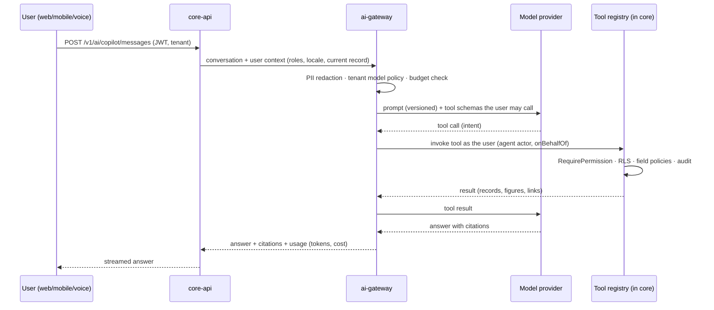

# 07 — AI Architecture

Status: **Draft for approval** · 2026-09-27 · Answers brief v2 deliverable 8 (and §39–§41, §50, §74) · Builds on PRD §6, ADR-0003 (LLM row), [01](01-system-architecture.md) containers `ai-gateway`, `ml-service`, `agent-runtime`

---

## 1. Principles

1. **AI is a user, not a superuser.** Every AI read and write goes through the same use cases, authorisation (ADR-0014), row-level security and audit as a human request, acting as the invoking user (`actor.type = 'agent'`, `onBehalfOf = user`). There is no AI database role and no AI-only API.
2. **Tools, not text.** The copilot answers by calling typed tools that return real data, then explains the result and cites the records used. When no tool can answer, it says so; it does not guess numbers.
3. **Proposals, not actions, for anything high-impact.** Agents produce drafts (a PR, a reschedule, an NCR). Executing them needs a human or an approval rule (approval engine ☑). Thresholds are per tenant configuration.
4. **Provider-agnostic.** One `ai-gateway` hides model providers. Default provider: Anthropic Claude (latest models). Self-hosted open-weight models are supported for tenants who forbid external processing (open question Q9).
5. **Every prediction is explainable.** Each prediction stores its value, confidence, main input factors, timestamp and model version (brief §41).

## 2. Copilot request pipeline (brief §39)

- **Intent → permission → tool → result → explanation** is enforced structurally. The model only sees tools the user is allowed to call (filtered by the permission registry), and each tool checks again when invoked.
- **Tools are declared by modules** next to their use cases: name, description, Zod input/output schema, required permission, and a side-effect class (`read`, `draft`, `execute`). Only `read` and `draft` tools are callable from copilot chat; `execute` tools need an approval.
- **Field policies apply to AI output.** A field hidden from the user (for example cost) is redacted from tool results before the model sees it.
- **Streaming** uses server-sent events from core-api.

## 3. Agents (brief §40)

An agent is a named, versioned configuration: goal, trigger (event, schedule or user), allowed tools, budget (tokens and money per run and per day), approval thresholds, and the user or service account it acts for.

- Runs execute as Temporal workflows (ADR-0010) in `agent-runtime`: durable, resumable, visible, with timeouts and retries.
- Every step is logged in `ai_action_log`: inputs, tool calls, outputs, a reasoning summary, cost, and the approval that authorised any execution.
- Everything an agent creates is labelled AI-generated and reversible (a draft that can be discarded, or a posting that can be reversed; ledgers are never edited).
- Human-in-the-loop comes from the approval engine ☑: an agent's proposal is an approval request like any other, with SLA, escalation and notifications.
- Kill switch: per tenant and per agent, effective immediately.

Initial agents, in build order: implementation agent (Excel/Tally mapping, Phase 1), procurement agent (shortages → draft PRs, Phase 2), quality agent (drafts NCR/CAPA, Phase 2), maintenance agent (anomaly → work order draft, Phase 3), planning agent (disruption → reschedule proposal, Phase 3), collections and month-end agents (Phase 4). The other agents in brief §40 (sales, HR, customer service, supply chain, management) follow the same template and are Phase 4.

## 4. Knowledge and search (RAG)

- Embeddings are stored in pgvector (ADR-0003), **one index per tenant, filtered by RLS**, with document-level access control copied from the DMS (step 0.13). A user cannot retrieve a chunk from a document they cannot open.
- Sources: SOPs, manuals, drawings' metadata, specifications, past NCRs, help content.
- Natural-language search (brief §49) = search port (Postgres FTS + trigram) + semantic re-rank, both under RLS.

## 5. Document intelligence (brief §50)

Pipeline: upload (DMS) → OCR/layout (provider adapter) → LLM field extraction to a typed schema (invoice, PO, delivery challan, certificate) → confidence per field → **human verification screen** → the target use case (for example, create a purchase invoice draft). Nothing posts without verification unless the tenant sets a confidence threshold and an approval rule allows it.

## 6. ML pipelines (brief §41)

| Model                                  | Service                              | Phase | Inputs                                         |
| -------------------------------------- | ------------------------------------ | ----- | ---------------------------------------------- |
| Demand forecast                        | ml-service (statsforecast, LightGBM) | 2     | Sales history, orders, seasonality, promotions |
| Lead-time prediction                   | ml-service                           | 2     | PO history, supplier, item, season             |
| Payment-delay / cash-flow              | ml-service                           | 2–4   | AR history, customer behaviour                 |
| Machine failure, remaining useful life | ml-service on TimescaleDB            | 3–4   | Telemetry, maintenance history                 |
| Quality prediction                     | ml-service                           | 3–4   | Process parameters, SPC series                 |
| Inventory optimisation                 | optimizer (OR-Tools)                 | 3     | Forecast, lead times, service levels           |

- Training reads from the analytics store, never from OLTP ([11](11-data-and-api-architecture.md)).
- **Model registry** (MLflow-compatible metadata in Postgres): model, version, training data window, metrics, approval status. Only approved versions serve.
- Predictions are written back as events and read models. They are never written into transactional records without a user action.

## 7. AI governance (brief §74)

| Control                 | Implementation                                                                                                                  |
| ----------------------- | ------------------------------------------------------------------------------------------------------------------------------- |
| Model registry          | Section 6; LLM models are also registered (provider, model id, allowed data classes)                                            |
| Prompt management       | Prompts are versioned files in the repo; the active version is recorded on every call                                           |
| AI audit logs           | `ai_action_log` (append-only, tenant RLS), linked to the platform audit trail                                                   |
| Usage and cost tracking | Per tenant, per user, per feature; metered for billing (entitlements, step 0.11)                                                |
| Budgets                 | Per tenant and per agent; the gateway refuses calls over budget                                                                 |
| Evaluation              | Golden question sets per tool, in CI (see [12](12-testing-strategy.md) §AI evaluation); regressions block releases              |
| Hallucination controls  | Numeric answers must come from tool results; answers without citations are flagged; figures are re-checked against tool outputs |
| Data access             | Only via tools under the user's permissions; field-level redaction; no raw SQL tool                                             |
| PII controls            | Redaction before external providers; tenant policy can forbid external providers entirely                                       |
| Human approval          | Approval engine for `execute` tools and above-threshold agent actions                                                           |
| Fallback models         | Gateway routes to a secondary provider or model on outage or policy; degradation is logged                                      |

## 8. Security considerations specific to AI

- **Prompt injection:** content from documents, emails and portal users is treated as untrusted data. It is wrapped and labelled in prompts, can never widen the tool set, and cannot trigger `execute` tools without approval.
- **Data residency:** a tenant-level policy selects allowed providers and regions (India-hosted where required).
- **Secrets:** provider keys live in the secrets manager, never in tenant configuration.

## 9. Open decisions

- Q9: whether tenant data may go to external LLM APIs, with redaction.
- A voice provider (speech-to-text in Kannada and Hindi) will be chosen in Phase 3; candidates will be compared on Indic accuracy (new question Q23).
