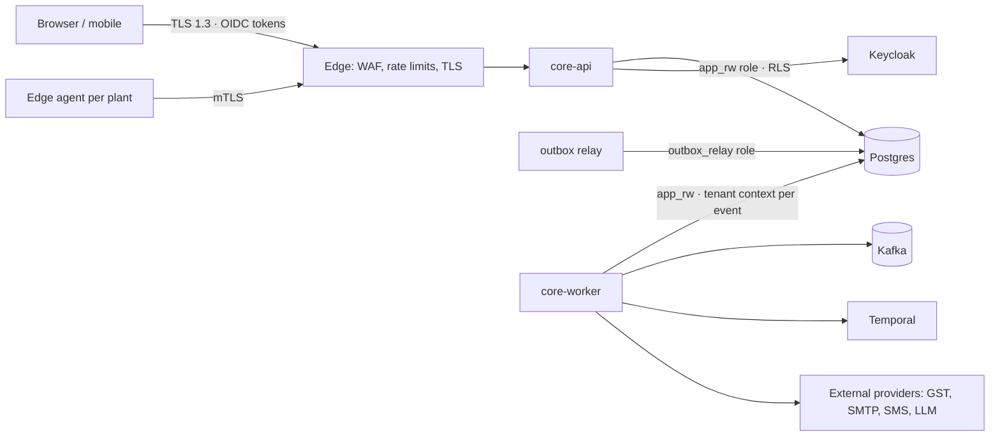

# 08 — Security Architecture

Status: **Draft for approval** · 2026-09-27 · Answers brief v2 deliverable 9 (and §51, §52, §72) · Consolidates PRD §12, ADR-0005, ADR-0009, ADR-0013, ADR-0014

Legend: ☑ built and tested · ◐ partly built · ☐ designed, not built (step or phase given)

---

## 1. Principles

Zero trust between components (every request is authenticated and authorised, including internal consumers); least privilege at every layer (database roles, service accounts, users, AI); secure defaults; and defence in depth, so that tenant isolation holds even if application code has a bug.

## 2. Trust boundaries

## 3. Controls

| Area                 | Control                                                                                                                                                                                                                                | State                                                                                                        |
| -------------------- | -------------------------------------------------------------------------------------------------------------------------------------------------------------------------------------------------------------------------------------- | ------------------------------------------------------------------------------------------------------------ |
| **Authentication**   | OIDC via Keycloak; JWT verified with JWKS (`jose`), issuer, audience and expiry checked; `WWW-Authenticate` on 401                                                                                                                     | ☑ 0.4                                                                                                        |
|                      | MFA, SSO (SAML/OIDC federation), password policy                                                                                                                                                                                       | ◐ delegated to Keycloak realm configuration; enforcement per tenant in 0.15                                  |
|                      | Session management: short access tokens, refresh rotation, revocation on user disable                                                                                                                                                  | ◐ Keycloak; disable → access denied ☑; session list UI ☐ 0.12                                                |
|                      | Device management (register, revoke)                                                                                                                                                                                                   | ◐ push devices in 0.10; trusted devices for MFA ☐ Phase 1                                                    |
| **Tenant isolation** | Postgres RLS on every tenant table; `app_rw` role cannot bypass RLS; composite `(tenant_id, id)` foreign keys; tenant from verified token plus membership (ADR-0013)                                                                   | ☑ 0.2–0.4, isolation tests in every suite                                                                    |
|                      | Tenant-aware cache keys, search, storage prefixes, analytics                                                                                                                                                                           | ☐ with each component (cache 0.14, search P1, storage 0.13)                                                  |
| **Authorisation**    | Every route declares `@Public`/`@AnyMember`/`@RequirePermission` (checked at boot); RBAC + scoped grants + Decimal ABAC conditions + validity dates; field policies (hide/lock, incl. custom fields); anti-escalation; owner safeguard | ☑ 0.5, 0.9                                                                                                   |
|                      | Segregation of duties (rules, violation checks, approval self-decision block)                                                                                                                                                          | ☑ 0.5, 0.8                                                                                                   |
| **Audit**            | Append-only audit log (trigger-enforced), who/what/when/before/after/source/correlation id; optional per-tenant SHA-256 hash chain with verification API                                                                               | ☑ 0.6                                                                                                        |
|                      | "Where" (client IP, user agent) and "reason" fields                                                                                                                                                                                    | ◐ client IP in request context ☑; reason captured on cancellations/decisions ☑; generic reason header ☐ 0.15 |
| **Data protection**  | TLS everywhere; encryption at rest (cloud KMS / LUKS on-prem); backups encrypted                                                                                                                                                       | ☐ infra, 0.14–0.15                                                                                           |
|                      | Secrets: env/secret manager only; config never prints values; no secrets in repo (CI scan)                                                                                                                                             | ◐ config ☑; secret scanning in CI ☐ 0.15                                                                     |
|                      | PII minimisation; DPDP/GDPR data-subject requests; retention policies                                                                                                                                                                  | ☐ Phase 1 (DSR tooling), 0.15 (retention)                                                                    |
| **API security**     | Zod validation of every input; RFC 9457 errors with stable codes, no stack traces; body size limit; idempotency keys; optimistic concurrency (ETag/If-Match)                                                                           | ☑ 0.3                                                                                                        |
|                      | Rate limiting per tenant, per user, per API key (Valkey token bucket)                                                                                                                                                                  | ☐ 0.15                                                                                                       |
|                      | API keys (scoped, hashed, rotatable) and OAuth client credentials for integrations                                                                                                                                                     | ☐ Phase 1                                                                                                    |
|                      | IP allow-lists per tenant                                                                                                                                                                                                              | ☐ 0.15 (Enterprise)                                                                                          |
| **Supply chain**     | Pinned toolchain, lockfile, `allowBuilds` allow-list for install scripts, dependency-cruiser boundaries                                                                                                                                | ☑ 0.1                                                                                                        |
|                      | Dependency and container scanning (OSV/Trivy), SBOM, signed images                                                                                                                                                                     | ☐ 0.15                                                                                                       |
| **Secure SDLC**      | Code review, type-aware lint, CI gates; threat model per module (STRIDE section in each phase plan)                                                                                                                                    | ◐                                                                                                            |
|                      | SAST (Semgrep), DAST (ZAP baseline), API fuzzing (Schemathesis)                                                                                                                                                                        | ☐ 0.15                                                                                                       |
|                      | Penetration test before GA                                                                                                                                                                                                             | ☐ Phase 1 exit                                                                                               |
| **Monitoring**       | Security alerts: repeated auth failures, permission denials spike, audit-chain break, new admin grant                                                                                                                                  | ☐ 0.14                                                                                                       |
| **AI**               | See [07](07-ai-architecture.md) §7–§8                                                                                                                                                                                                  | ☐ Phase 1+                                                                                                   |
| **Edge / IoT**       | mTLS device identity, per-plant certificates, outbound-only connections                                                                                                                                                                | ☐ Phase 3                                                                                                    |

## 4. Threat model summary (STRIDE, platform level)

| Threat                                | Main mitigations                                                                                                 |
| ------------------------------------- | ---------------------------------------------------------------------------------------------------------------- |
| Spoofing (stolen or forged token)     | Signature, issuer and audience checks; short expiry; MFA; membership lookup per request                          |
| Tampering (edit ledgers or audit)     | Append-only triggers (`MN001`), reversal-only corrections, hash chain, DB roles without UPDATE/DELETE on ledgers |
| Repudiation                           | Audit with actor, on-behalf-of, correlation id, source; approval decisions recorded with comments                |
| Information disclosure (cross-tenant) | RLS, composite FKs, tenant-scoped caches and search, isolation tests in CI; field policies inside a tenant       |
| Denial of service                     | Body limits, pagination caps, statement timeouts, rate limits, per-tenant worker quotas                          |
| Elevation of privilege                | Anti-escalation (cannot grant what you lack), owner safeguard, SoD, boot-time route check, AI acts as the user   |

## 5. Financial controls (brief §72)

Unauthorised payments → approval engine with amount conditions and SoD ☑ (engine), payment module Phase 1. Duplicate invoices → unique (supplier, supplier invoice number, fiscal year) plus fuzzy detection, Phase 1. Duplicate vendors → GSTIN/PAN uniqueness and similarity check in Master Data, Phase 1. Unauthorised discounts → price and discount limits as ABAC conditions ☑ (mechanism), Sales Phase 1. Fraud indicators → alert engine, Phase 2.
