# 09 — User-Role Matrix and Manufacturing Process Maps

Status: **Draft for approval** · 2026-09-27 · Answers brief v2 deliverables 11–13 · Role mechanics: ADR-0014 · System role templates: `modules/platform/src/authorisation/role-templates.ts`

---

## 1. How roles work (summary of ADR-0014)

- A **permission** is a code such as `procurement.purchase_order.approve`, registered by its module and checked on every route.
- A **role** is a named set of permissions. Workspaces get system role templates (kept up to date as modules add permissions) and can create custom roles.
- A **grant** assigns a role to a user, **scoped** to the whole tenant, a company or a plant, optionally with **ABAC conditions** (for example `amount ≤ 5,00,000`) and validity dates.
- **Field policies** hide or lock fields (for example cost price) per role; **SoD rules** block toxic combinations.
- Portal users (customers, suppliers) are `user_type = portal`: they only ever see records linked to their own party. Agents are `user_type = agent` and act on behalf of a user.

## 2. System role templates (built ☑) and planned additions

| Template                          | Scope typical       | Includes                                                                                                                    | State             |
| --------------------------------- | ------------------- | --------------------------------------------------------------------------------------------------------------------------- | ----------------- |
| owner                             | Tenant              | Everything incl. subscription and billing                                                                                   | ☑                 |
| administrator                     | Tenant              | Everything except subscription                                                                                              | ☑                 |
| finance                           | Company             | Finance and localisation (GST, TDS) modules, organisation read                                                              | ☑                 |
| sales                             | Company             | Sales module, organisation read                                                                                             | ☑                 |
| purchase                          | Company             | Procurement module                                                                                                          | ☑                 |
| stores                            | Plant               | Inventory module                                                                                                            | ☑                 |
| production                        | Plant               | Engineering and production modules                                                                                          | ☑                 |
| quality                           | Plant               | Quality module                                                                                                              | ☑                 |
| viewer                            | Any                 | Read-only everything (field policies still apply)                                                                           | ☑                 |
| planner                           | Plant               | Planning (MRP, scheduling), read inventory/sales/procurement                                                                | ☐ Phase 2         |
| maintenance                       | Plant               | Maintenance module, spares issue                                                                                            | ☐ Phase 2         |
| hr                                | Company             | HR module (sensitive personal data)                                                                                         | ☐ Phase 2         |
| operator                          | Plant / work centre | Shop-floor actions only: start/pause/complete job, report scrap/downtime, request material/maintenance, raise quality issue | ☐ Phase 1 (basic) |
| supervisor                        | Plant / line        | Operator + assign jobs, approve scrap/rework, shift reports                                                                 | ☐ Phase 1         |
| executive                         | Tenant              | Read dashboards, KPIs and control tower across companies; approve above thresholds                                          | ☐ Phase 1         |
| customer_portal / supplier_portal | Own party           | Portal functions only                                                                                                       | ☐ Phase 2         |

## 3. Persona × module matrix

C = create/edit · R = read · A = approve/release · X = execute on shop floor · — = no access. Every cell is subject to scope (company/plant), ABAC limits and field policies.

| Module ↓ / Persona →                  | Operator         | Supervisor | Stores          | Quality inspector | Maintenance tech | Planner       | Buyer         | Sales exec      | Accountant        | Plant head | CFO          | COO             | CEO | Admin | Customer (portal)   | Supplier (portal) |
| ------------------------------------- | ---------------- | ---------- | --------------- | ----------------- | ---------------- | ------------- | ------------- | --------------- | ----------------- | ---------- | ------------ | --------------- | --- | ----- | ------------------- | ----------------- |
| Platform admin (users, roles, config) | —                | —          | —               | —                 | —                | —             | —             | —               | —                 | R          | R            | R               | R   | C     | —                   | —                 |
| Master data                           | R*               | R          | C (items, bins) | R                 | R                | R             | C (suppliers) | C (customers)   | C (tax, accounts) | R          | R            | R               | R   | C     | —                   | —                 |
| Sales / CRM                           | —                | —          | R               | —                 | —                | R             | —             | C               | R                 | R          | R/A          | R               | R   | R     | own orders R        | —                 |
| Procurement                           | —                | —          | R               | R                 | R                | C (PR)        | C/A ≤ limit   | —               | R                 | A          | A > limit    | R               | R   | R     | —                   | own POs R, ASN C  |
| Inventory                             | request          | request/R  | C               | R (hold/release)  | spares issue     | R             | R             | R               | R                 | R          | R            | R               | R   | R     | —                   | —                 |
| Engineering (BOM, routing)            | R (instructions) | R          | R               | R                 | R                | R             | —             | R               | R                 | A          | R            | R               | R   | R     | —                   | —                 |
| Planning / MRP                        | —                | R          | R               | —                 | —                | C/A           | R             | R               | —                 | A          | R            | R               | R   | R     | —                   | own schedules R   |
| Production / MES                      | X                | X/A        | R               | R                 | R                | C             | —             | R               | R                 | A          | R            | R               | R   | R     | status R            | —                 |
| Quality                               | raise issue      | C          | R               | C/A               | R                | R             | R             | R               | —                 | A          | R            | R               | R   | R     | certificates R      | own results R     |
| Maintenance                           | request          | request    | R               | —                 | C/X              | R             | R             | —               | R                 | A          | R            | R               | R   | R     | —                   | —                 |
| Finance                               | —                | —          | —               | —                 | —                | —             | R (invoices)  | R (receivables) | C/A ≤ limit       | R          | C/A          | R               | R   | R     | own invoices R, pay | own invoices C    |
| HR / shifts                           | own              | team R     | own             | own               | own              | R (calendars) | own           | own             | own               | R          | R            | R               | R   | R     | —                   | —                 |
| Analytics / dashboards                | shift target     | line       | stores          | quality           | maintenance      | planning      | procurement   | sales           | finance           | plant      | finance, all | operations, all | all | R     | —                   | scorecard         |
| AI copilot                            | voice (limited)  | ✓          | ✓               | ✓                 | ✓                | ✓             | ✓             | ✓               | ✓                 | ✓          | ✓            | ✓               | ✓   | ✓     | ✓ (portal scope)    | ✓ (portal scope)  |

\* Operators see only the item and instruction data on their current job.

SoD rules seeded (☑): creating a supplier vs approving its payment; creating a PO vs approving it; posting a journal vs approving it. More per module as they arrive.

## 4. Manufacturing process maps

The standard flows that must work end to end (PRD §18). Each step names the owning context and the event that hands off to the next. The full golden scenario trace is in [02](02-context-map.md) §4.

### 4.1 Quote-to-cash (make-to-order)

```mermaid
flowchart LR
  Q[Quotation · Sales] -->|QuotationAccepted| SO[Sales order · Sales]
  SO -->|SalesOrderConfirmed| ATP{ATP / CTP · Planning}
  ATP -->|stock available| RES[Reservation · Inventory]
  ATP -->|shortage| MRP[MRP run · Planning]
  MRP -->|PlannedOrderReleased| WO[Work order · Production]
  MRP -->|PurchaseRequisitionCreated| P2P[[Procure-to-pay]]
  WO -->|ProductionConfirmed| FG[FG receipt · Inventory]
  FG -->|InspectionLotCreated| QI[Final inspection · Quality]
  QI -->|UsageDecisionAccepted| DEL[Delivery · Sales/Logistics]
  DEL -->|DeliveryPosted| INV[Tax invoice + e-invoice + e-way bill · Sales/Localisation]
  INV -->|InvoicePosted| AR[AR open item · Finance]
  AR -->|PaymentReceived| REC[Bank reconciliation · Finance]
  REC --> NOTIF[Customer notification · Platform]
  REC --> ANA[Analytics]
```

### 4.2 Procure-to-pay

PR (Procurement, approval if above limit) → RFQ and quotation comparison → PO (approval, SoD) → supplier portal/WhatsApp → ASN → goods receipt (Inventory, lot created, QC hold) → incoming inspection (Quality; failure → quarantine and NCR) → release to stock (stock ledger + GL: inventory Dr / GRNI Cr) → purchase invoice with 3-way match (Finance; tolerances; GST ITC) → payment run (approval, SoD) → bank reconciliation.

### 4.3 Plan-to-produce

Forecast and orders → MPS → MRP (BOM explosion, lot sizing, lead times, safety stock) → planned orders → release to work orders → APS finite scheduling (machines, labour, tools, calendars, maintenance windows) → dispatch to work centres → material issue (FEFO/FIFO) → operations on the shop floor (start, pause, confirm, scrap, downtime) → production confirmation (WIP and FG ledger, costing) → genealogy link (lots, machines, operators, parameters).

### 4.4 Issue-to-resolution (quality)

Inspection failure, SPC drift or customer complaint → NCR (Quality) → containment (quarantine stock, Inventory) → root cause (5-why/8D/fishbone) → CAPA with owners and due dates (approvals, notifications) → effectiveness check → closure; costs flow to cost of quality (Costing).

### 4.5 Maintain-to-run

Asset register → preventive plans (time or meter) and predictive alerts (IoT/ML) → maintenance order → spares reservation and issue → execution with checklist → downtime recorded (feeds OEE and APS availability) → costs to asset and cost centre.

### 4.6 Record-to-report

Sub-ledger postings (inventory, AR, AP, payroll, assets) → GL (double-entry, append-only) → period close checklist (Temporal workflow) → GST returns and TDS → financial statements and consolidation → management reports.

### 4.7 Hire-to-retire

Employee onboarding → skills and certifications → machine authorisation → shift rosters and attendance → payroll integration → training and competency → exit.
